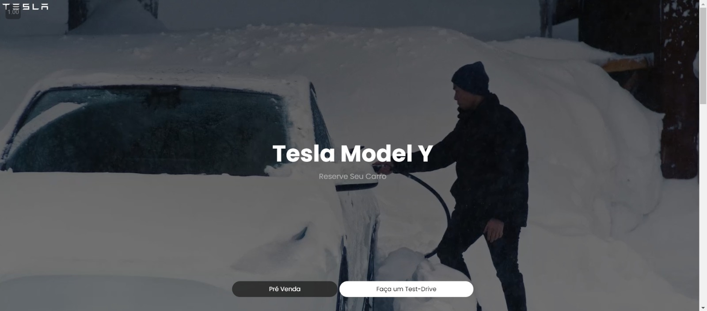
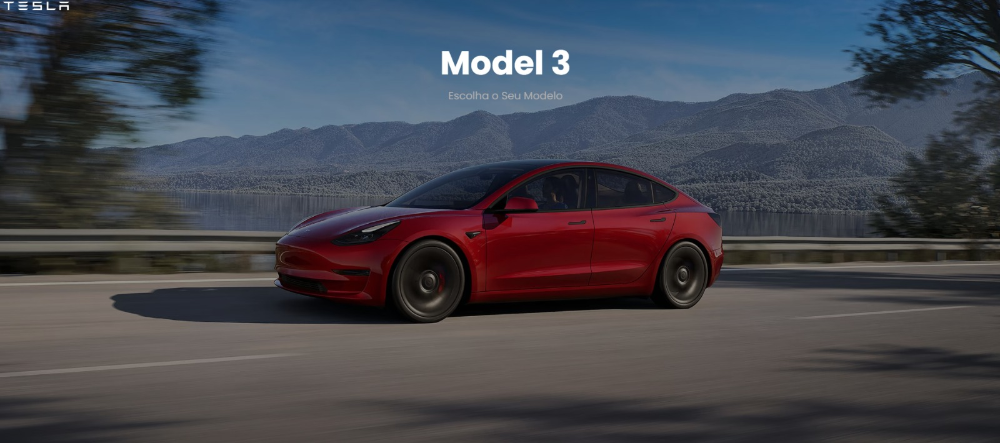
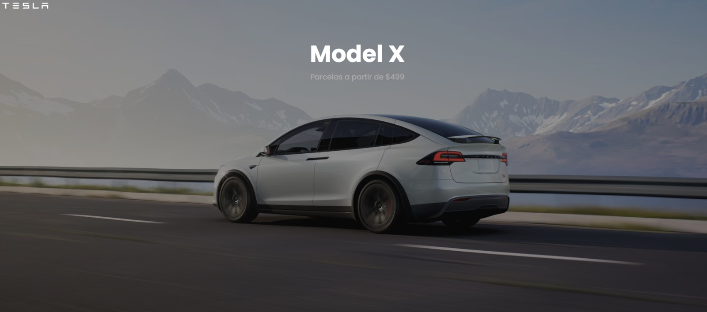
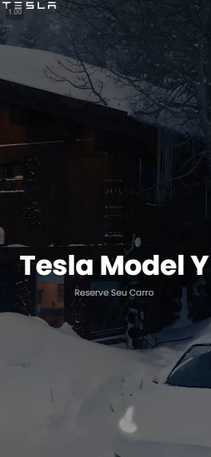
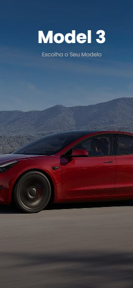

# 🚗 Projeto Tesla 
 

---

## 🌐 Site feito utilizando:

-  **HTML5** - Estrutura do site.
-  **CSS3** - Estilização e responsividade.
-  **JavaScript** - Funcionalidade interativa.

---

## 💻 Projetado para versões Desktop e Mobile 📱

O site foi desenvolvido com foco na **responsividade**, adaptando-se bem tanto em **versões desktop** quanto **mobile**.

### Exemplo na versão Desktop:

  
  

### Exemplo na versão Mobile:

  

---

## 🎨 Estilo Clean e Funcional

A interface foi desenhada para garantir uma **experiência simples e intuitiva**, proporcionando uma navegação limpa e sem distrações.

---

## 🛠️ Funcionalidades

- **Design Responsivo**: O layout se adapta automaticamente para diferentes tamanhos de tela, garantindo uma boa visualização em desktops e dispositivos móveis.
- **Interface Limpa**: Foco em um design simples e objetivo para facilitar a navegação.
- **Experiência Intuitiva**: A interface foi pensada para que o usuário não precise de nenhum tutorial para navegar no site.

---

## 📸 Galeria de Imagens

Aqui estão algumas imagens do projeto:

  
  

---

